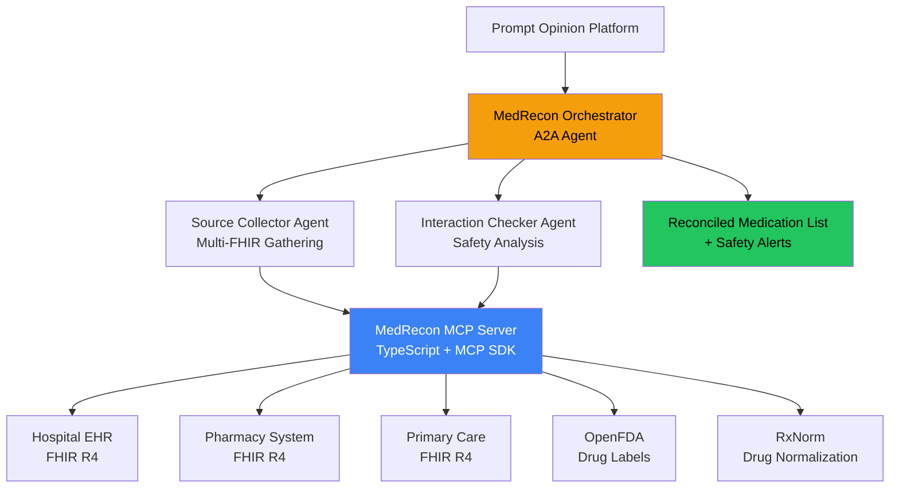

# MedRecon - Intelligent Medication Reconciliation

An AI-powered medication reconciliation system that helps healthcare professionals safely manage patient medications at care transitions. Built for the [Agents Assemble Healthcare AI Hackathon](https://agentsassemble.devpost.com/).

## What It Does

MedRecon pulls medication lists from FHIR health records, checks for drug-drug interactions, identifies discrepancies between data sources, and produces structured reconciliation reports with clinical safety alerts.

**The Problem**: Medication errors at care transitions cause 30% of hospital readmissions. Reconciliation is manual, tedious, and error-prone -- multiple data sources (EHR, pharmacy, patient self-report) rarely agree.

**The Solution**: A multi-agent system using the A2A protocol and MCP tools that automates medication reconciliation with real FHIR data and evidence-based drug interaction checking.

## Architecture



**Current (Week 1):** Single agent + MCP server with 7 clinical tools, querying live FHIR data and RxNorm APIs.
**Target (Week 3+):** Full 3-agent A2A network with multi-source reconciliation.

### MCP Server Tools

| Tool | Description |
|------|-------------|
| `get_medications` | Retrieves patient medication list from FHIR MedicationRequest/MedicationStatement resources |
| `check_interactions` | Checks drug-drug interactions using curated clinical database and OpenFDA drug labels |
| `lookup_drug_info` | Looks up drug information via RxNorm API: RxCUI, ATC drug class, brand/generic names, dosage forms |
| `check_allergies` | Cross-references patient FHIR allergies against drug names with fuzzy matching and drug class cross-reactivity |
| `find_alternatives` | Finds therapeutic alternatives using ATC classification from RxNorm/RxClass |
| `validate_dose` | Validates medication doses against curated safe dose ranges for 18 common drugs |
| `reconcile_lists` | Reconciles medication lists from multiple sources, flags discrepancies and missing drugs (core tool) |

### Agent Capabilities

- Retrieve patient medication lists from any FHIR R4 server
- Check drug-drug interactions with severity ratings (SEVERE, MODERATE, MILD)
- Identify medication discrepancies between different sources
- Produce structured reconciliation reports with clinical recommendations
- FHIR context propagation via SHARP on MCP

## Quick Start

### Prerequisites

- Node.js 20+ and npm
- Python 3.12+
- A Google API key for Gemini ([get one free](https://aistudio.google.com/app/apikey))

### 1. Start the MCP Server

```bash
cd mcp-server
npm install
npm start
# Server runs on http://localhost:5000
```

### 2. Start the Agent

```bash
cd agent
python3 -m venv venv
source venv/bin/activate
pip install -r requirements.txt

# Create .env file
cp .env.example .env
# Edit .env and add your GOOGLE_API_KEY

# Start the A2A agent
uvicorn medrecon_agent.app:a2a_app --host 0.0.0.0 --port 8001
```

### 3. Test End-to-End

```bash
cd agent
source venv/bin/activate
python3 ../scripts/test-agent.py
```

This will:
1. Query HAPI FHIR public server for patient 131283452's medications
2. Check all medications for drug-drug interactions
3. Produce a reconciliation report

### Test MCP Tools Directly

```bash
python3 scripts/test-mcp-tools.py
```

## Demo Scenario

**Patient**: ID 131283452 on HAPI FHIR public server (hapi.fhir.org/baseR4)

**Medications** (11 active):
- Apixaban 5mg BID, Metoprolol, Lisinopril, Atorvastatin, Aspirin 81mg daily
- Ceftriaxone IV, Metronidazole IV, Normal Saline 1L IV, Morphine 1mg IV
- Mesalamine, Verapamil

**Interactions Found**:
- SEVERE: Metoprolol + Verapamil (risk of severe bradycardia and heart block)
- MODERATE: Apixaban + Aspirin (increased bleeding risk)
- 20+ CHECK-level interactions from OpenFDA requiring clinical review

## Tech Stack

- **Agent Framework**: Google ADK + A2A Protocol
- **MCP Server**: @modelcontextprotocol/sdk + Express
- **LLM**: Google Gemini 2.5 Flash
- **FHIR**: HAPI FHIR R4 (public test server)
- **Drug Interactions**: Curated clinical database + OpenFDA API
- **Drug Information**: RxNorm API (NLM) + RxClass ATC classification
- **Languages**: Python 3.12, TypeScript 5.8

## Project Structure

```
medrecon/
  mcp-server/          # TypeScript MCP server
    tools/             # MCP tool implementations
    index.ts           # Server entry point
  agent/               # Python A2A agent
    medrecon_agent/    # Agent definition
    shared/            # Shared utilities
  scripts/             # Test and utility scripts
  docs/                # Documentation
```

## License

MIT

## Acknowledgments

Built on the [Prompt Opinion](https://promptopinion.ai/) platform templates (po-adk-python, po-community-mcp).
Uses FHIR R4 standard for healthcare data interoperability.
