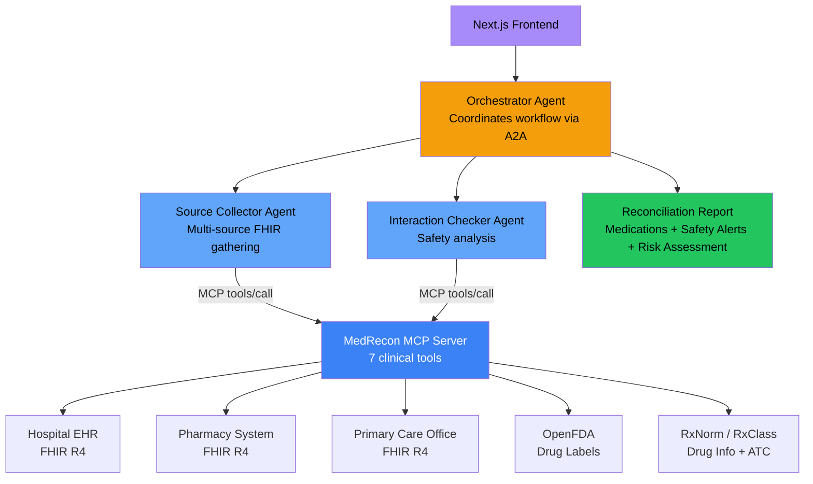

# MedRecon - Intelligent Medication Reconciliation

An AI-powered medication reconciliation system that helps healthcare professionals safely manage patient medications at care transitions. Built for the [Agents Assemble Healthcare AI Hackathon](https://agents-assemble.devpost.com/).

**Live Demo**: [frontend-eta-flax-63.vercel.app](https://frontend-eta-flax-63.vercel.app)

## What It Does

MedRecon pulls medication lists from FHIR health records across multiple care settings, checks for drug-drug interactions, identifies discrepancies between data sources, and produces structured reconciliation reports with clinical safety alerts.

**The Problem**: Medication errors at care transitions cause 30% of hospital readmissions. Reconciliation is manual, tedious, and error-prone -- multiple data sources (hospital EHR, pharmacy, primary care) rarely agree.

**The Solution**: A 3-agent system using the A2A protocol and MCP tools that automates medication reconciliation with real FHIR data and evidence-based drug interaction checking.

## Architecture



### Agent Roles

| Agent | Protocol | Role |
|-------|----------|------|
| **Orchestrator** | A2A (port 8003) | Coordinates Source Collector + Interaction Checker, assembles final report |
| **Source Collector** | A2A (port 8001) | Gathers medications from 3 FHIR sources (simulating hospital/pharmacy/PCP silos), merges with source attribution |
| **Interaction Checker** | A2A (port 8002) | Runs drug interactions, allergy cross-reference, dose validation, finds alternatives |

### MCP Server Tools

| Tool | Description |
|------|-------------|
| `get_medications` | Retrieves patient medication list from FHIR MedicationRequest/MedicationStatement resources |
| `check_interactions` | Checks drug-drug interactions using curated clinical database (48 interactions) and OpenFDA drug labels |
| `lookup_drug_info` | Looks up drug information via RxNorm API: RxCUI, ATC drug class, brand/generic names, dosage forms |
| `check_allergies` | Cross-references patient FHIR allergies against drug names with fuzzy matching and drug class cross-reactivity |
| `find_alternatives` | Finds therapeutic alternatives using ATC classification from RxNorm/RxClass |
| `validate_dose` | Validates medication doses against curated safe dose ranges for 18 common drugs |
| `reconcile_lists` | Reconciles medication lists from multiple sources, flags discrepancies and missing drugs |

## Quick Start

### Prerequisites

- Node.js 20+ and npm
- Python 3.12+
- A Google API key for Gemini ([get one free](https://aistudio.google.com/app/apikey))

### Start All Services

```bash
# Start all 4 services at once:
./scripts/start-all.sh

# Or manually:
cd mcp-server && npm install && npm start                     # port 5000
cd agent && source venv/bin/activate
uvicorn source_collector.app:a2a_app --port 8001
uvicorn interaction_checker.app:a2a_app --port 8002
uvicorn orchestrator.app:a2a_app --port 8003
```

### Test End-to-End

```bash
# Test the full 3-agent pipeline
cd agent && source venv/bin/activate
python3 ../scripts/test-orchestrator.py

# Test individual MCP tools
python3 ../scripts/test-mcp-tools.py
```

## Demo Patients

5 synthetic patients with complex polypharmacy, loaded into HAPI FHIR public server:

| ID | Name | Meds | Key Interactions |
|----|------|------|-----------------|
| `131494564` | Margaret Ann Chen | 11 | SEVERE: Metoprolol+Verapamil, Warfarin+Amiodarone |
| `131494583` | Robert James Williams | 11 | SEVERE: Methotrexate+NSAID |
| `131494601` | Dorothy Mae Johnson | 12 | SEVERE: Simvastatin+Clarithromycin, Sertraline+Tramadol |
| `131494623` | James Michael Rivera | 11 | SEVERE: Lithium+NSAID, MODERATE: Lithium+ACE inhibitor |
| `131494641` | Sarah Elizabeth Patel | 13 | SEVERE: Warfarin+Fluconazole, Levodopa+Metoclopramide |

Generate more: `python3 scripts/generate-demo-patients.py`

## Cloud Run Deployment

All services deployed to GCP Cloud Run (us-central1):

| Service | URL |
|---------|-----|
| MCP Server | https://medrecon-mcp-93135657352.us-central1.run.app |
| Source Collector | https://medrecon-source-collector-93135657352.us-central1.run.app |
| Interaction Checker | https://medrecon-interaction-checker-93135657352.us-central1.run.app |
| Orchestrator | https://medrecon-orchestrator-93135657352.us-central1.run.app |
| Frontend | https://frontend-eta-flax-63.vercel.app |

**Health check:** `curl https://medrecon-mcp-93135657352.us-central1.run.app/health`

**Agent cards:** `curl https://medrecon-orchestrator-93135657352.us-central1.run.app/.well-known/agent-card.json`

## Tech Stack

- **Agent Framework**: Google ADK + A2A Protocol
- **MCP Server**: @modelcontextprotocol/sdk + Express
- **LLM**: Google Gemini 2.5 Flash
- **Frontend**: Next.js 14, Tailwind CSS, Vercel
- **FHIR**: HAPI FHIR R4 (public test server)
- **Drug Interactions**: Curated clinical database (48 interactions) + OpenFDA API
- **Drug Information**: RxNorm API (NLM) + RxClass ATC classification
- **Deployment**: GCP Cloud Run (auto-scales to zero)
- **Languages**: Python 3.12, TypeScript 5.8

## Project Structure

```
medrecon/
  mcp-server/              # TypeScript MCP server (7 clinical tools)
    tools/                 # MCP tool implementations
    index.ts               # Server entry point
  agent/                   # Python A2A agents
    source_collector/      # Source Collector (multi-FHIR gathering)
    interaction_checker/   # Interaction Checker (safety analysis)
    orchestrator/          # Orchestrator (workflow coordination)
    medrecon_agent/        # Single-agent fallback
    shared/                # MCP tool wrappers, FHIR hooks, app factory
  frontend/                # Next.js 14 dashboard
    src/components/        # Dashboard, ReportPanel, PipelineVisualizer
    src/app/api/           # API routes (medications, interactions, orchestrator)
    src/lib/               # MCP client, A2A client, types
  scripts/                 # Test and utility scripts
```

## License

MIT

## Acknowledgments

Built on the [Prompt Opinion](https://promptopinion.ai/) platform templates (po-adk-python, po-community-mcp).
Uses FHIR R4 standard for healthcare data interoperability.
